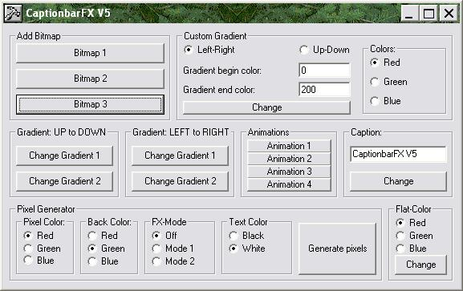



## CaptionBarFX

### Description

This changes the captionbar of a form, it can change it's look and even add bitmaps to it.

I resubmit this code because many people asked me where to download it, well here it is.
 
### More Info
 

             |
---                |---
**Submitted On**   |2004-02-06 17:22:18
**By**             |[Peter Hebels](https://github.com/Planet-Source-Code/PSCIndex/blob/master/ByAuthor/peter-hebels.md)
**Level**          |Advanced
**User Rating**    |4.8 (19 globes from 4 users)
**Compatibility**  |VB 5\.0, VB 6\.0
**Category**       |[Graphics](https://github.com/Planet-Source-Code/PSCIndex/blob/master/ByCategory/graphics__1-46.md)
**World**          |[Visual Basic](https://github.com/Planet-Source-Code/PSCIndex/blob/master/ByWorld/visual-basic.md)
**Archive File**   |[CaptionBar177942872004\.zip](https://github.com/Planet-Source-Code/peter-hebels-captionbarfx__1-55432/archive/master.zip)

